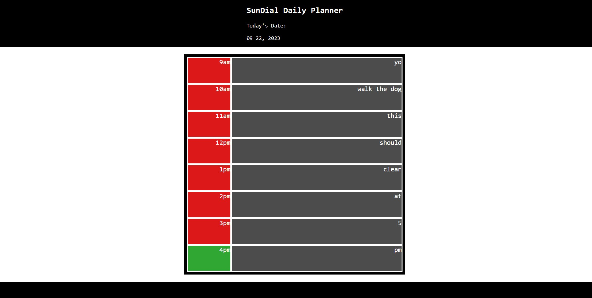

# SunDial Daily Planner

## Description:
This is a daily planner designed like a sundial!
The current hour will be green, while the past will be red, and the future will be blue.
You can add events to your planner by typing them into the input box and pressing enter to save them. 
At 5pm the planner will automatically clear all your plans from the day.
Depending on what time you view the site, will determine what you can see and do. Just like a sundial!

Deployed Link: https://emk2473.github.io/daily-planner/

Repo Link: https://github.com/EMK2473/daily-planner/

Screenshot of Deployed Site:

