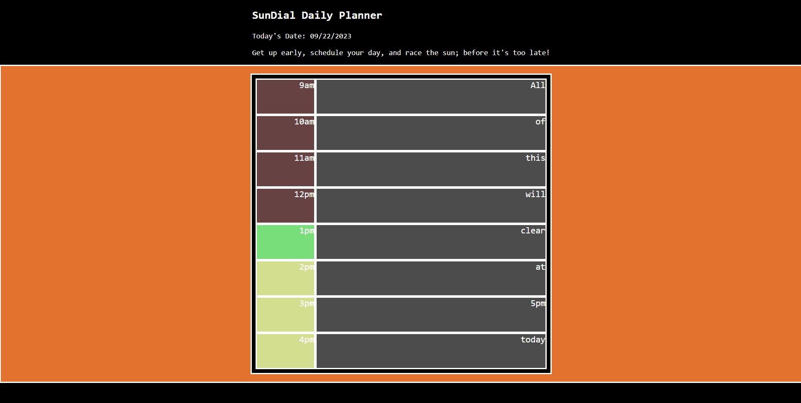

# SunDial Daily Planner

## Description:
- This is a daily planner designed like a sundial.
- The current hour will be green, while the past will be red, and the future will be yellow.
- You can add events to your planner by typing them into the input box, and save them by pressing enter. 
- Upon refreshing the page after 5pm, the events will automatically clear from the day; because you can't schedule things in the past!
- Depending on what time you view the site, will determine what you see.
- So, get up early, schedule your day, and race the sun; before it's too late!

Deployed Link: https://emk2473.github.io/daily-planner/

Repo Link: https://github.com/EMK2473/daily-planner/

Screenshot of Deployed Site:

